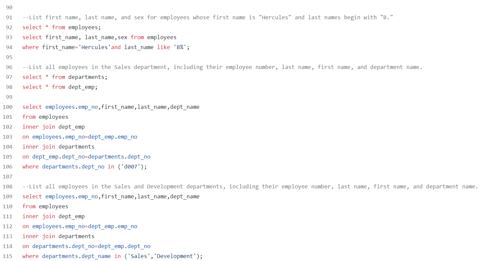
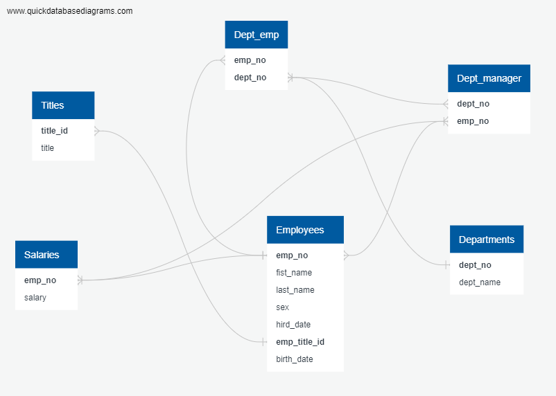
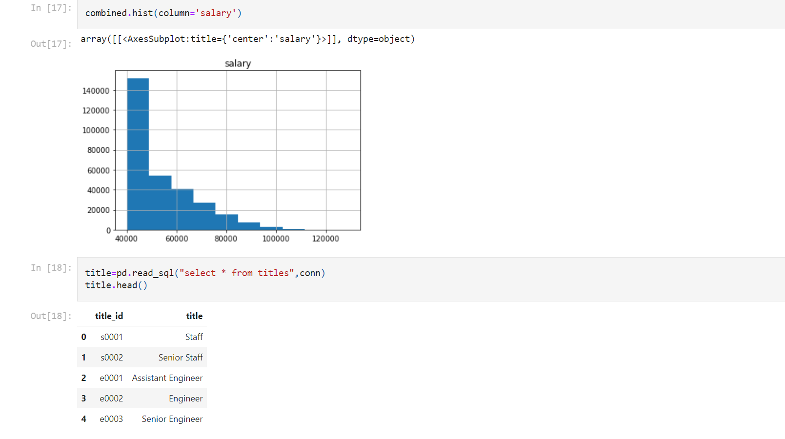

# Employee Database Analysis
 
-Data Modeling
Inspect the CSVs and sketch out an ERD of the tables. 

-Data Engineering
Use the information to create a table schema for each of the six CSV files. 

For the primary keys check to see if the column is unique, otherwise create a composite key. Which takes to primary keys in order to uniquely identify a row.
Be sure to create tables in the correct order to handle foreign keys.

Import each CSV file into the corresponding SQL table. Note be sure to import the data in the same order that the tables were created and account for the headers when importing to avoid errors.

-Data Analysis
After I have a complete database, finish the following:

List the following details of each employee: employee number, last name, first name, sex, and salary.

List first name, last name, and hire date for employees who were hired in 1986.

List the manager of each department with the following information: department number, department name, the manager's employee number, last name, first name.

List the department of each employee with the following information: employee number, last name, first name, and department name.

List first name, last name, and sex for employees whose first name is "Hercules" and last names begin with "B."

List all employees in the Sales department, including their employee number, last name, first name, and department name.

List all employees in the Sales and Development departments, including their employee number, last name, first name, and department name.

In descending order, list the frequency count of employee last names.

-Generate visualization
Finally take steps to generate a visualization of the data, with which I could easily present to management team.

